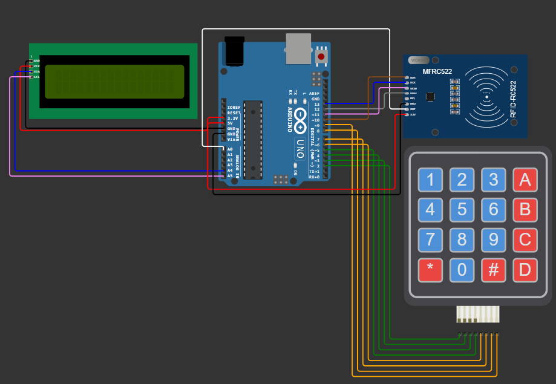

This projects goal is producing a vault for boardgames that making easy to deal with the currency.

We use 
->RFID-RC522  for reading credit cards.
->I2C LCD 2x16 Screen for giving a simple output to players.
->4x4 Keypad for writing input to our vault.

1. Libraries: `MFRC522`, `LiquidCrystal_I2C`, `Keypad`
